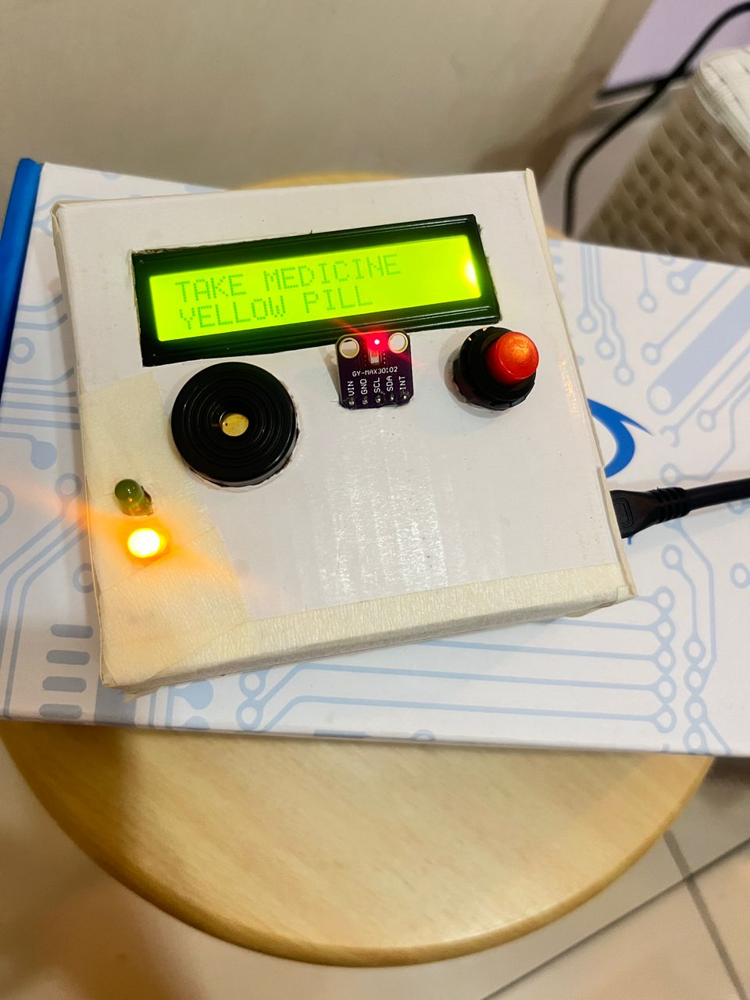
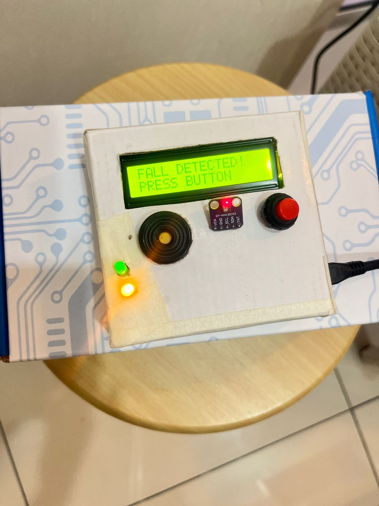

# smart-health-monitoring-system
IoT-based wearable health monitoring and fall detection system using ESP8266

## 📸 Project Images

### 🩺 Heart Rate & SpO2 Reading

### 🔧 Internal Components

### 💊 Medicine Reminder

### 🚨 Fall Detection Test

### 🔧 Internal Components

